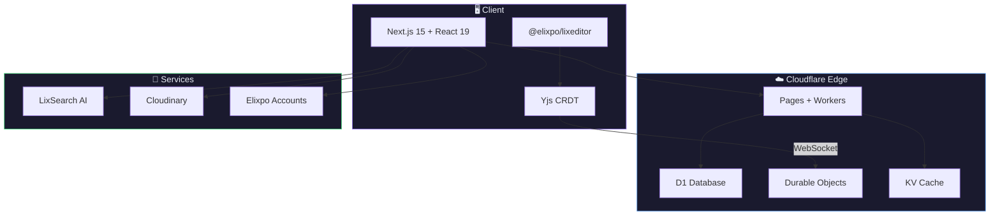

<div align="center">


# LixBlogs

### Write, collaborate, and publish beautifully.

A modern blogging platform with a rich block editor, AI writing assistant,<br />
real-time collaboration, and organizations — all on the edge.

<br />

[](https://blogs.elixpo.com)
[](https://github.com/elixpo/lixblogs)
[](https://www.npmjs.com/package/@elixpo/lixeditor)
[](https://marketplace.visualstudio.com/items?itemName=elixpo.lixeditor)
[](LICENSE)

[](https://nextjs.org)
[](https://react.dev)
[](https://pages.cloudflare.com)
[](https://tailwindcss.com)
[](https://blocknotejs.org)

[Website](https://blogs.elixpo.com) ·
[Discussions](https://github.com/orgs/elixpo/discussions) ·
[Monorepo](https://github.com/elixpo/elixpo_chapter) ·
[Sponsor](https://github.com/sponsors/Circuit-Overtime)

</div>

<br />

<div align="center">

</div>

<br />

## About

LixBlogs (also called **Elixpo Blogs**) is a **free, open-source blogging
platform** designed for creators, developers, and teams. It gives you a
beautiful writing experience with powerful tools built right in — a rich block
editor, an AI writing assistant, real-time collaboration, and organizations —
all deployed on **Cloudflare's edge** and hosted at
[blogs.elixpo.com](https://blogs.elixpo.com).

Whether you're writing a personal blog, publishing under your organization, or
co-authoring with teammates in real-time, LixBlogs has you covered. No plugins
to install, no complicated setup, no premium tiers.

This is a monorepo: alongside the platform it ships **`@elixpo/lixeditor`** (the
editor on npm) and the **LixEditor** VS Code extension. It is part of the wider
Elixpo ecosystem.

<br />

<div align="center">

| | Feature | Description |
|:---:|:---|:---|
| :sparkles: | **AI Writing Assistant** | Press `Space` on an empty line — generate text, images, and get inline suggestions |
| :jigsaw: | **Rich Block Editor** | 20+ block types — code, math equations, diagrams, embeds, tables, and more |
| :busts_in_silhouette: | **Real-Time Collaboration** | Invite co-authors and edit together with live cursors and presence |
| :office: | **Organizations & Teams** | Create orgs, assign roles, organize content into collections |
| :cloud: | **Auto-Save & Cloud Sync** | Drafts save locally and sync to the cloud — never lose a word |
| :art: | **Themes & Customization** | Light & dark modes, custom page colors, cover images, page emojis |
| :link: | **Link Previews** | Hover any link to see a rich OG preview card with title, image, favicon |
| :page_facing_up: | **Sub-Pages** | Nest pages inside your blog for structured, multi-page content |
| :framed_picture: | **Media Uploads** | Drag & drop images, auto-compressed to WebP, tier-based storage |
| :bookmark_tabs: | **Library & Bookmarks** | Save posts, organize into collections, track reading history |

</div>

## The ecosystem

| Tool | What it does | Link |
| --- | --- | --- |
| 🎨 **Elixpo Art** | AI image generation _(under dev)_ | [art.elixpo.com](https://elixpo.com) |
| ✍️ **Elixpo Blogs** | A rich, modern writing and publishing space | [blogs.elixpo.com](https://blogs.elixpo.com) |
| 🖊️ **LixSketch** | A hand-drawn style whiteboard for ideas and diagrams | [sketch.elixpo.com](https://sketch.elixpo.com) |
| 💬 **Elixpo Chat** | A fluid, real-time AI chat experience _(under dev)_ | [chat.elixpo.com](https://chat.elixpo.com) |
| 🔎 **Elixpo Search** | Fast, AI-assisted search | [search.elixpo.com](https://search.elixpo.com) |
| 👤 **Elixpo Accounts** | One identity (SSO) across the ecosystem | [accounts.elixpo.com](https://accounts.elixpo.com) |
| 🔗 **lixrl** | Our flagship URL shortener | [lixrl.com](https://lixrl.com) |
| 🪪 **Portfolios** | Personal pages to showcase your work | [me.elixpo.com](https://me.elixpo.com) |
| 🐼 **Oreo** | The mascot's home | [oreo.elixpo.com](https://oreo.elixpo.com) |

Developers can drop our editors into their own projects with the
**`@elixpo/lixsketch`** and **`@elixpo/lixeditor`** packages, on npm and as VS
Code extensions.

<br />


## `@elixpo/lixeditor` — Use Our Editor Anywhere

The editor that powers LixBlogs is available as a **standalone npm package**. Drop it into any React or Next.js app to get a fully-featured WYSIWYG editor with equations, diagrams, code highlighting, and more.

```bash
npm install @elixpo/lixeditor @blocknote/core @blocknote/react @blocknote/mantine
```

```jsx
import { LixEditor, LixPreview, LixThemeProvider } from '@elixpo/lixeditor';
import '@blocknote/core/fonts/inter.css';
import '@blocknote/mantine/style.css';
import '@elixpo/lixeditor/styles';

function App() {
  const [blocks, setBlocks] = useState(null);

  return (
    <LixThemeProvider defaultTheme="dark">
      <LixEditor
        initialContent={blocks}
        onChange={(editor) => setBlocks(editor.getBlocks())}
        features={{ equations: true, mermaid: true, codeHighlighting: true }}
        placeholder="Start writing..."
      />
      <LixPreview blocks={blocks} />
    </LixThemeProvider>
  );
}
```

<div align="center">

| Feature | Default | Description |
|---------|:-------:|-------------|
| `equations` | :white_check_mark: | Block & inline LaTeX via KaTeX |
| `mermaid` | :white_check_mark: | Mermaid diagrams (flowcharts, sequence, git graphs) |
| `codeHighlighting` | :white_check_mark: | Shiki syntax highlighting — 30+ languages |
| `tableOfContents` | :white_check_mark: | Auto-generated TOC from headings |
| `images` | :white_check_mark: | Upload, embed URL, paste, drag & drop |
| `dates` | :white_check_mark: | Inline date picker chips |
| `linkPreview` | :white_check_mark: | OG metadata tooltip on link hover |
| `markdownLinks` | :white_check_mark: | Auto-convert `[text](url)` and `` |

</div>

Every feature is toggleable. Override CSS variables to match your brand:

```css
:root {
  --lix-accent: #e040fb;
  --lix-bg-app: #fafafa;
  --lix-font-body: 'Inter', sans-serif;
}
```

:point_right: **[Full documentation →](packages/lixeditor/README.md)**

<br />

## LixEditor for VS Code

Write `.lixeditor` documents with a rich WYSIWYG editor — right inside VS Code.

<div align="center">

[](https://marketplace.visualstudio.com/items?itemName=elixpo.lixeditor)

</div>

| | Feature |
|:---:|:---|
| :writing_hand: | Rich block editor — headings, lists, tables, checklists |
| :art: | Syntax-highlighted code blocks (25+ languages via Shiki) |
| :link: | Smart links — auto-convert `[text](url)`, hover preview |
| :framed_picture: | Image blocks — upload, embed URL, paste, drag & drop |
| :calendar: | Date stamps — `Ctrl+D` to insert |
| :zap: | Slash commands — type `/` to insert any block |
| :floppy_disk: | Auto-save + manual save + Markdown export |
| :art: | Adapts to your VS Code theme (light/dark) |

```
1. Install the extension from the VS Code Marketplace
2. Create a file: notes.lixeditor
3. Open it — the rich editor loads automatically
4. Type / for commands, write with markdown shortcuts
```

:point_right: **[Extension docs →](packages/vscode-lixeditor/README.md)**

<br />

## How It Works


<br />

## The Editor

The heart of LixBlogs is a **powerful block editor** built on [BlockNote](https://blocknotejs.org) — it feels like writing in Notion, but built for publishing.

<div align="center">

| Block Type | What It Does |
|:---|:---|
| Paragraphs, Headings | Standard text with markdown shortcuts |
| Code Blocks | Syntax-highlighted with 30+ languages via Shiki |
| Math / LaTeX | Block & inline equations with KaTeX rendering |
| Mermaid Diagrams | Flowcharts, sequence diagrams, git graphs, and more |
| Images | Upload, embed URL, paste, drag & drop — auto WebP compression |
| Links | Auto-convert URLs, `[text](url)` syntax, OG preview on hover |
| Tables | Full table support with header rows |
| Checklists | Interactive checkboxes with checked/unchecked styling |
| Table of Contents | Auto-generated from your headings |
| Sub-Pages | Nest child pages inside your blog |
| Date Stamps | Inline date chips with a mini calendar picker |
| Mentions | Tag users `@name`, blogs, and organizations |
| Dividers | Horizontal rules to separate sections |

</div>

<br />

## Monorepo layout

```
.
├── app/                       # Next.js App Router pages, layouts, API routes
├── src/                       # React components (Editor/), views, context, AI
├── lib/                       # Server-side utilities (auth, media, tiers)
├── migrations/                # Cloudflare D1 SQL migrations
├── worker/                    # Cloudflare Worker code
├── packages/
│   ├── lixeditor/             # @elixpo/lixeditor — the editor (npm)
│   ├── vscode-lixeditor/      # elixpo.lixeditor — VS Code extension
│   └── lixsketch/             # @elixpo/lixsketch — the whiteboard editor
└── public/                    # Static assets, brand marks, fonts
```

## Architecture



<br />

## Running locally

```bash
npm install
npm run dev
```

Then open [http://localhost:3000](http://localhost:3000).

```bash
npm run build       # Build for Cloudflare Pages (@cloudflare/next-on-pages)
npm run preview     # Local Cloudflare Pages preview (wrangler)
npm run deploy      # Build + deploy to Cloudflare Pages
npm run db:migrate  # Run D1 migrations (remote)
```

<br />

## Built by the community

Elixpo is made by people, in the open. **45+ contributors** have shaped these
tools, with a small core team steering the way:

- **Ayushman Bhattacharya** - Founder & Lead ([@Circuit-Overtime](https://github.com/Circuit-Overtime))
- **Vivek Yadav** - Lead Co-Dev ([@ez-vivek](https://github.com/ez-vivek))
- **Anwesha Chakraborty** - Core Maintainer ([@anwe-ch](https://github.com/anwe-ch))

Everyone is welcome. See **[CONTRIBUTING.md](CONTRIBUTING.md)** and our
**[Code of Conduct](CODE_OF_CONDUCT.md)**.

## Recognition & programs

Elixpo has taken part in and been supported by **GSSOC**, **Hacktoberfest**,
**Pollinations.AI**, **MS Startup Foundations**, and **OSCI**.

## Get involved

- 💬 **Join the conversation** in [GitHub Discussions](https://github.com/orgs/elixpo/discussions).
- 🚀 **Submit your project** to be featured across the ecosystem.
- 🛠️ **Contribute** - browse good first issues in the [monorepo](https://github.com/elixpo/elixpo_chapter).
- ❤️ **Support us** via [GitHub Sponsors](https://github.com/sponsors/Circuit-Overtime).

## Project Activity

<div align="center">

[](https://www.star-history.com/?repos=elixpo%2Flixblogs&type=date&legend=top-left)

<br />


</div>

<br />

## Brand assets

Brand-ready marks and per-service icons live under [`public/`](public/) (logos,
mascot marks, `og-image`, and the Lix\* brand fonts under
[`public/fonts/`](public/fonts/)). A browsable kit is at
**[elixpo.com/assets](https://elixpo.com/assets)**.

## License

Elixpo uses one **licensing standard** across every repository:

- **Code** - [MIT](LICENSES/preferred/MIT) (with the [Oreo-trademarks exception](LICENSES/exceptions/Oreo-trademarks)).
- **Brand & visual assets** - [CC-BY-4.0](LICENSES/preferred/CC-BY-4.0) (with the same exception).

The Oreo mascot, the chest E-badge, and the "Elixpo" and "Oreo" names, domains,
and palette are reserved - this protects the brand and its royalties while
keeping the code and assets free. See [`LICENSE`](LICENSE) and the per-product
notice board, [`NOTICE`](LICENSES/NOTICE).

## Exclusive

> Per-repo "exclusive" artifacts (an npm package, a VS Code extension, a hosted
> SaaS, a paid tier) are declared here and in [`NOTICE`](LICENSES/NOTICE).

**This repository ships:**

- **npm package `@elixpo/lixeditor`** (from [`packages/lixeditor/`](packages/lixeditor/)) — the published package name on the npm registry is reserved to Elixpo; forks must publish under a different name. The MIT-licensed source may be reused.
- **VS Code Marketplace extension `elixpo.lixeditor`** (publisher `elixpo`, from [`packages/vscode-lixeditor/`](packages/vscode-lixeditor/)) — the Marketplace listing and the `elixpo` publisher identity are reserved to Elixpo; the extension source is MIT but the listing/publisher are not transferred.
- **Hosted SaaS `blogs.elixpo.com`** — the official hosted LixBlogs deployment; the brand, hosted deployment, and operational data are reserved; the source is MIT.

Developers can use **[`@elixpo/lixeditor`](https://www.npmjs.com/package/@elixpo/lixeditor)** (npm) and the **[LixEditor VS Code extension](https://marketplace.visualstudio.com/items?itemName=elixpo.lixeditor)** in their own projects under MIT.


<div align="center">

**Made with :purple_heart: by [Elixpo](https://github.com/elixpo)**

[Website](https://blogs.elixpo.com) · [npm Package](https://www.npmjs.com/package/@elixpo/lixeditor) · [VS Code Extension](https://marketplace.visualstudio.com/items?itemName=elixpo.lixeditor) · [Report Bug](https://github.com/elixpo/lixblogs/issues) · [Request Feature](https://github.com/elixpo/lixblogs/issues)

<sub>Made in the open, together. © 2023-2026 Elixpo.</sub>

</div>
